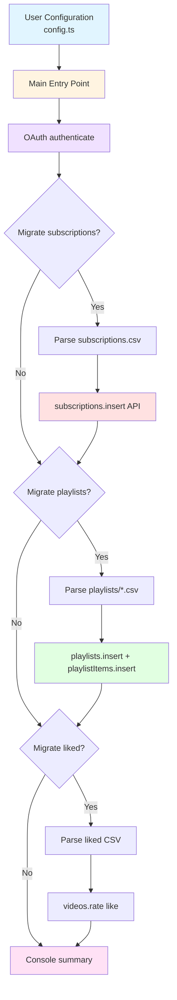

# YouTube Merger

A TypeScript CLI tool that migrates **subscriptions**, **playlists**, and **liked videos** from a [Google Takeout](https://takeout.google.com/) YouTube export into another YouTube account using the **YouTube Data API v3**, with OAuth 2.0 (desktop), rate-limit-aware retries, and configurable migration sections.

Built in March 2026. This CLI project automatically reads your exported Takeout CSVs to batch-insert subscriptions, recreate playlists, and like videos on a new account while handling API quotas.

## Features

- **Restore subscriptions** from Takeout `subscriptions.csv`
- **Recreate playlists** from the `playlists/*.csv` files (excluding liked/watch-later special files where applicable)
- **Re-like videos** using the liked-videos export
- **OAuth 2.0 (Desktop)** — Browser consent once; `token.json` reused on later runs
- **Retries** — Handles transient errors; treats HTTP 409 as duplicate where appropriate
- **Configurable** — Toggle subscriptions, playlists, or liked videos; set paths and delay between calls
- **Type-safe** — TypeScript throughout

## Architecture



## Getting Started

### Prerequisites

- Node.js (v18+ recommended)
- pnpm
- Google Cloud account with YouTube Data API v3 enabled
- Google Takeout export with YouTube data

### Installation

1. Clone the repository:

```bash
git clone https://github.com/orassayag/youtube-merger.git
cd youtube-merger
```

2. Install dependencies:

```bash
pnpm install
```

3. Build the project:

```bash
pnpm build
```

4. Open [Google Cloud Console](https://console.cloud.google.com/) and create or select a project.
5. Enable **YouTube Data API v3**.
6. Create **OAuth 2.0 Client ID** credentials of type **Desktop app**.
7. Download the JSON and save it as `credentials.json` in the project root.

## Configuration

Edit `src/config.ts`:

```typescript
export const CONFIG = {
  credentialsPath: './credentials.json',
  tokenPath: './token.json',
  takeoutPath: './Takeout/YouTube and YouTube Music',
  migrate: {
    subscriptions: true,
    playlists: true,
    likedVideos: true,
  },
  rateLimitDelay: 500,
} as const;
```

**Security:** Never commit `credentials.json` or `token.json`. Both are listed in `.gitignore`.

## Usage

First run opens a browser (or prints a URL) for OAuth. Paste the authorization code when prompted. Later runs reuse `token.json`.

```bash
pnpm start
# or
pnpm migrate
```

Example console output:

```
🚀 YouTube Takeout Migration

✅ Authenticated using saved token.

📋 Migrating 42 subscriptions...
  → Channel Name... ✅

📋 Migrating 3 playlists...
  📁 Creating playlist "Favorites" (120 videos)...
  ✅ "Favorites": 120/120 videos added

📋 Liking 500 videos...
  ✅ 500/500 videos liked

🎉 Migration complete!
```

## Project Structure

```text
youtube-merger/
├── src/
│   ├── main.ts                 # Entry point
│   ├── config.ts               # Paths, flags, rate limit
│   ├── types/
│   │   └── index.ts            # Shared types (e.g. ApiResult)
│   ├── auth/
│   │   └── oauth.ts            # OAuth2 desktop flow
│   ├── api/
│   │   ├── retry.ts            # delay, withRetry
│   │   └── __tests__/
│   ├── parsers/
│   │   ├── takeoutCsv.ts       # CSV parsing
│   │   └── __tests__/
│   └── migrate/
│       ├── subscriptions.ts
│       ├── playlists.ts
│       └── likedVideos.ts
├── package.json
├── tsconfig.json
├── README.md
├── CONTRIBUTING.md
└── INSTRUCTIONS.md
```

## How It Works

1. **Authentication** loads `credentials.json`, reuses `token.json` when present, otherwise runs the desktop OAuth code exchange.
2. **Subscriptions** reads `subscriptions/subscriptions.csv` and calls `subscriptions.insert` per channel.
3. **Playlists** scans `playlists/*.csv`, skips filenames that look like liked or watch-later exports, creates a private playlist per file, then `playlistItems.insert` for each video ID.
4. **Liked videos** finds a CSV whose name contains `liked`, parses video IDs, and calls `videos.rate` with `rating: "like"`.
5. **Retries** back off on errors; HTTP **403** (quota) waits longer; **409** is treated as already present where applicable.

## Troubleshooting

- **Quota exceeded:** The YouTube Data API uses a daily quota. Reduce batch size, increase `rateLimitDelay`, or run phases on different days by toggling `migrate` flags.
- **Invalid or expired token:** Delete `token.json` and run again to re-authorize.
- **CSV not found:** Confirm `takeoutPath` points at the inner YouTube folder that contains `subscriptions` and `playlists`.

## Contributing

Contributions to this project are [released](https://help.github.com/articles/github-terms-of-service/#6-contributions-under-repository-license) to the public under the [project's open source license](LICENSE).

Everyone is welcome to contribute. Contributing doesn't just mean submitting pull requests—there are many different ways to get involved, including answering questions and reporting issues.

Please read [CONTRIBUTING.md](CONTRIBUTING.md) for details on our code of conduct and the process for submitting pull requests.

## Author

- **Or Assayag** - _Initial work_ - [orassayag](https://github.com/orassayag)
- Or Assayag <orassayag@gmail.com>
- GitHub: https://github.com/orassayag
- StackOverflow: https://stackoverflow.com/users/4442606/or-assayag?tab=profile
- LinkedIn: https://linkedin.com/in/orassayag

## License

This project is licensed under the MIT License - see the [LICENSE](LICENSE) file for details.
